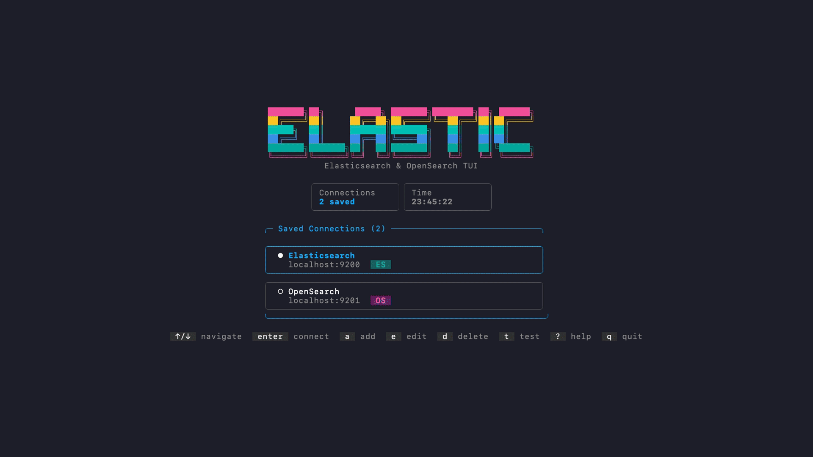
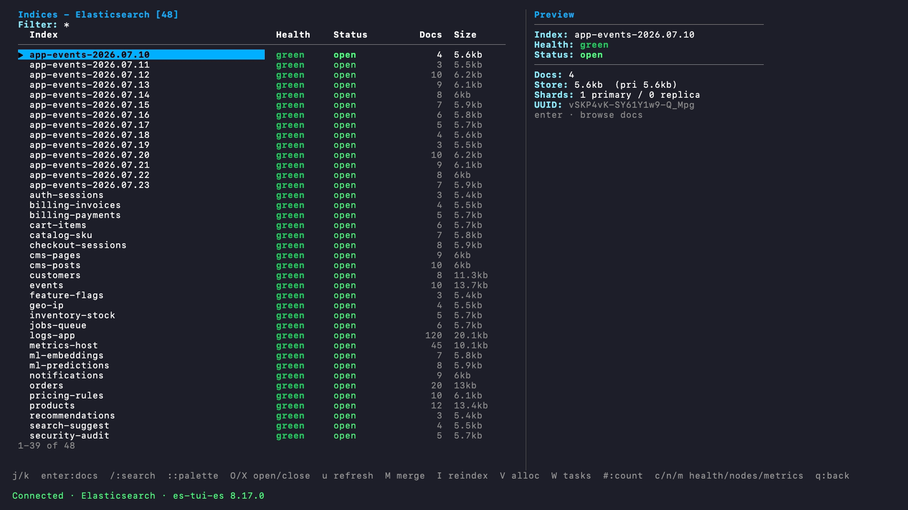
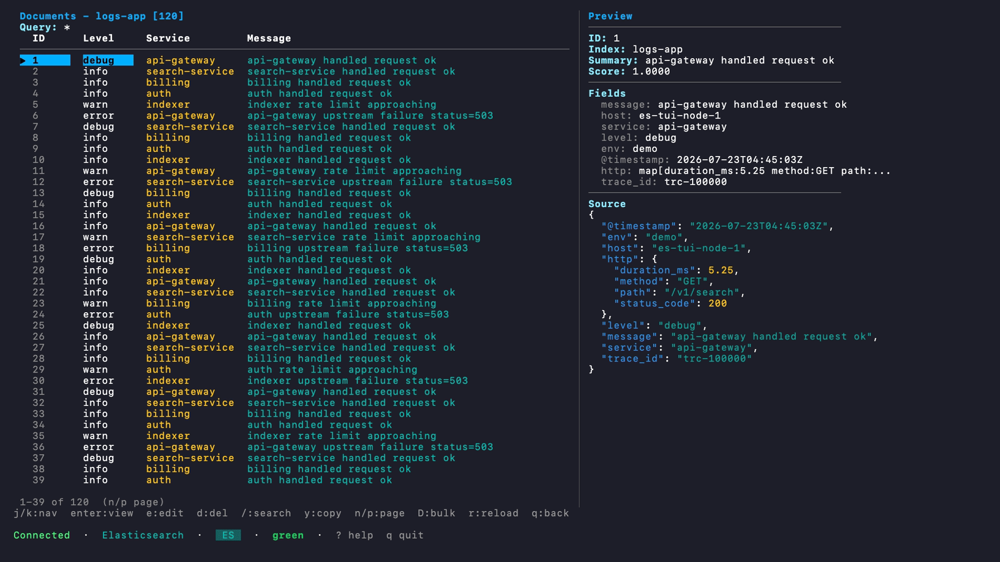
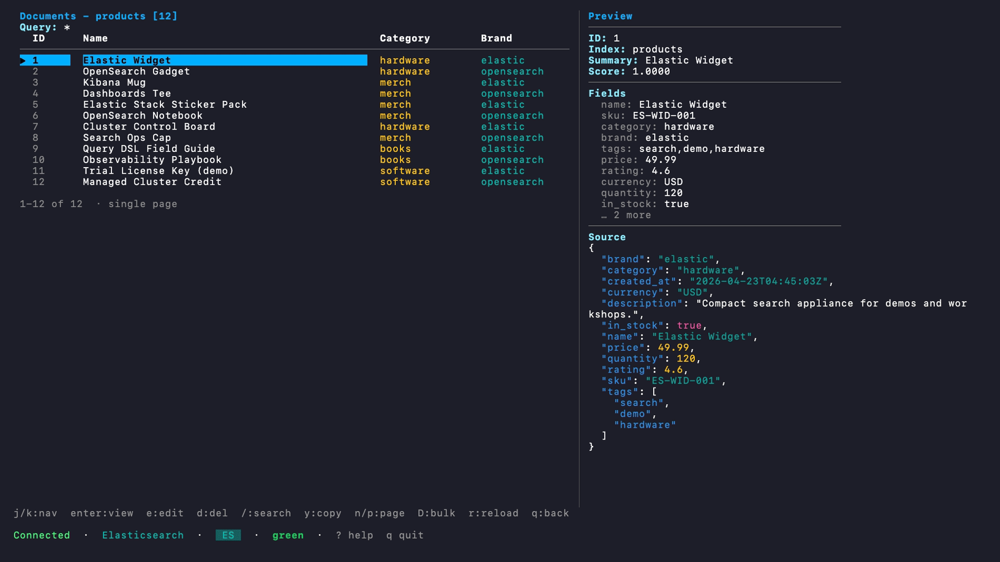
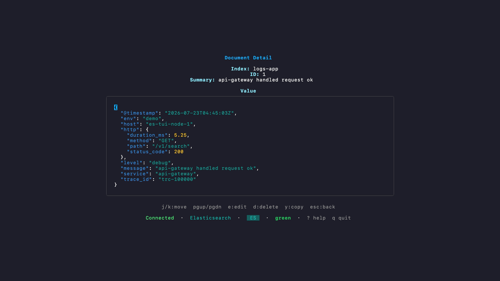
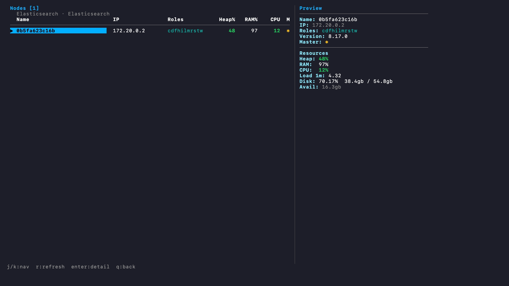

# es-tui

[](https://github.com/davidbudnick/es-tui/actions/workflows/ci.yml)
[](https://github.com/davidbudnick/es-tui/actions/workflows/release.yml)
[](https://github.com/davidbudnick/es-tui/actions/workflows/ci.yml)
[](https://opensource.org/licenses/MIT)

Lightweight Elasticsearch / OpenSearch TUI Manager — browse indices, search documents, and monitor cluster health from the terminal. Built with Go and [Bubble Tea](https://github.com/charmbracelet/bubbletea).

The connection screen uses a multicolor palette inspired by the Elastic logo (pink, yellow, teal, blue, green).



## Quick Install

```bash
# Native install — recommended (macOS and Linux)
curl -fsSL https://raw.githubusercontent.com/davidbudnick/es-tui/main/install.sh | bash

# Homebrew (macOS and Linux)
brew tap davidbudnick/homebrew-tap
brew install --cask es-tui

# Go (requires Go 1.26+)
go install github.com/davidbudnick/es-tui@latest
```

> **Pre-built binaries** — [Download from GitHub Releases](https://github.com/davidbudnick/es-tui/releases)

## Screenshots

### Index browser



### Documents · logs (smart columns + JSON preview)



### Documents · products



### Document detail



### Nodes



## Features

### Browsing and Search

- **Index browser** with pattern filtering and redis-style split list + preview
- **Document browser** with query_string or full JSON Query DSL, source columns, and JSON preview
- **Document detail** with syntax-highlighted JSON and scroll
- **Search console** across one index or the whole cluster (pagination, history)
- **Favorites and recent indices** for quick access
- **Saved queries** persisted to disk
- **Explain API** and **count** from the search / palette flows
- **Export** matching documents as NDJSON

### Cluster and Index Ops

- **Cluster health** and **node list** (roles, heap, RAM, CPU, master)
- **Shards**, **aliases**, and **index templates**
- **Live metrics** — docs, store size, search latency, JVM heap, CPU, sparklines
- **Disk allocation**, **tasks** (cancel), **plugins**, **data streams**
- **Cluster settings** and **snapshots** (list by repository)
- **Create / delete / open / close / refresh / force-merge** indices
- **Reindex** (async task)
- **Index / update / delete documents**, delete-by-query bulk delete
- **Cat API explorer** for ad-hoc `_cat/*` calls
- **Command palette** (`:`) for jumping to any screen

### Connections

- **CLI quick connect** — `--host`, `--port`, `--user`, `--password`, `--api-key`, `--bearer`, `--flavor`, `--read-only`
- **Connection manager** with saved instances
- **TLS/SSL** support (client certs, CA, skip-verify)
- **Auto-detect** Elasticsearch vs OpenSearch (or force with `--flavor`)
- **Read-only mode** blocks mutations
- Secrets (password, API key, bearer) are **never written** to disk

## Installation

### Native Install (Recommended)

The install script auto-detects your OS and architecture, downloads the latest release, verifies the checksum, and installs the binary to `~/.local/bin` (override with `INSTALL_DIR`):

```bash
curl -fsSL https://raw.githubusercontent.com/davidbudnick/es-tui/main/install.sh | bash

# Custom install directory
INSTALL_DIR=/usr/local/bin curl -fsSL https://raw.githubusercontent.com/davidbudnick/es-tui/main/install.sh | bash
```

### Homebrew

See [Quick Install](#quick-install) above.

### From Source

```bash
git clone https://github.com/davidbudnick/es-tui.git
cd es-tui
make build
make install
```

### Pre-built Binaries

Download the latest release from the [Releases](https://github.com/davidbudnick/es-tui/releases) page. Pre-built binaries are available for macOS, Linux, and Windows with no Go installation required.

### Using Go Install

> **Note:** Requires Go 1.26 or later.

```bash
go install github.com/davidbudnick/es-tui@latest
```

## Usage

```bash
# Interactive connection manager
es-tui

# Quick connect to Elasticsearch (default port 9200)
es-tui --host localhost

# OpenSearch on 9201
es-tui --host localhost --port 9201 --flavor opensearch

# Basic auth + TLS
es-tui --host es.example.com --tls --user elastic --password secret

# API key
es-tui --host es.example.com --api-key "$ES_API_KEY" --tls

# Bearer token + read-only
es-tui --host es.example.com --bearer "$TOKEN" --read-only --tls

# Version / self-update
es-tui --version
es-tui --update
```

When `--host` is provided the TUI connects automatically on startup. Without flags the interactive connection manager is shown.

Press `?` inside the app for the full help screen. Press `:` for the command palette.

### CLI Flags

| Flag | Short | Description | Default |
| --- | --- | --- | --- |
| `--host` | `-h` | Server hostname | |
| `--port` | `-p` | Server port | 9200 |
| `--password` | `-a` | Basic auth password | |
| `--user` | | Basic auth username | |
| `--api-key` | | API key auth | |
| `--bearer` | | Bearer token auth | |
| `--name` | | Connection display name | `host:port` |
| `--flavor` | | `auto`, `elasticsearch`, `opensearch` | auto |
| `--read-only` | | Block mutations | false |
| `--tls` | | Enable TLS | false |
| `--tls-cert` | | Client certificate | |
| `--tls-key` | | Client key | |
| `--tls-ca` | | CA certificate | |
| `--tls-skip-verify` | | Skip TLS verify | false |
| `--version` | | Print version | |
| `--update` | | Self-update | |

### Uninstall

```bash
# Native install
rm -f ~/.local/bin/es-tui

# Homebrew
brew uninstall --cask es-tui

# Go
rm -f $(go env GOPATH)/bin/es-tui
```

<details>
<summary>Keyboard Shortcuts</summary>

### Global

| Key | Action | Key | Action |
| --- | --- | --- | --- |
| `q` / `esc` | Quit / go back | `r` | Refresh |
| `?` | Help | `:` | Command palette |
| `j` / `k` | Navigate | `Ctrl+C` | Force quit |

### Connections

| Key | Action | Key | Action |
| --- | --- | --- | --- |
| `Enter` | Connect | `a` | Add connection |
| `e` | Edit | `d` | Delete |
| `t` | Test connection | | |

### Indices

| Key | Action | Key | Action |
| --- | --- | --- | --- |
| `Enter` | Browse documents | `i` | Index detail |
| `f` | Filter pattern | `/` | Search |
| `O` / `X` | Open / close index | `u` / `M` | Refresh / force-merge |
| `I` | Reindex | `a` | Create index |
| `d` | Delete index | `c` / `n` / `m` | Health / nodes / metrics |
| `V` / `W` | Allocation / tasks | `E` / `U` / `Z` | Data streams / settings / snapshots |
| `Y` / `Q` / `#` | Saved queries / export / count | `A` / `T` / `C` | Aliases / templates / cat API |
| `F` / `R` / `L` | Favorites / recent / logs | `*` | Toggle favorite |

### Search

| Key | Action | Key | Action |
| --- | --- | --- | --- |
| `Enter` | Run query / open hit | `j` / `k` | Navigate hits |
| `n` / `p` | Next / prev page | `y` | Copy JSON |
| `S` | Save query | `x` / `#` | Explain / count |

### Documents

| Key | Action | Key | Action |
| --- | --- | --- | --- |
| `Enter` | Open document | `/` / `f` | Search / filter |
| `y` | Copy | `n` / `p` | Page |
| `e` | Edit | `d` / `D` | Delete / bulk delete |

</details>

## Docker Compose Examples

Need a cluster to try es-tui? Docker Compose files are included under [`examples/`](examples/README.md).

```bash
# Elasticsearch on :9200 + OpenSearch on :9201
make docker-up
make docker-seed

# Elasticsearch only
make docker-up-es
make docker-seed-es
./bin/es-tui --host localhost --port 9200

# OpenSearch only
make docker-up-os
make docker-seed-os
./bin/es-tui --host localhost --port 9201 --flavor opensearch

make docker-down
```

Seeded demo indices: `products`, `customers`, `orders`, `logs-app`, `metrics-host`, `events` (plus aliases `shop` / `catalog` → `products`).

## Configuration

Configuration is stored in `~/.config/es-tui/config.json`.

### Example Configuration

```json
{
  "connections": [
    {
      "id": 1,
      "name": "Elasticsearch",
      "host": "localhost",
      "port": 9200,
      "flavor": "elasticsearch",
      "created_at": "2025-01-01T00:00:00Z",
      "updated_at": "2025-01-01T00:00:00Z"
    },
    {
      "id": 2,
      "name": "OpenSearch",
      "host": "localhost",
      "port": 9201,
      "flavor": "opensearch",
      "created_at": "2025-01-01T00:00:00Z",
      "updated_at": "2025-01-01T00:00:00Z"
    },
    {
      "id": 3,
      "name": "Prod (TLS)",
      "host": "es.example.com",
      "port": 9200,
      "username": "elastic",
      "flavor": "auto",
      "use_tls": true,
      "tls_config": {
        "ca_file": "/path/to/ca.pem",
        "insecure_skip_verify": false
      },
      "read_only": true,
      "created_at": "2025-01-01T00:00:00Z",
      "updated_at": "2025-01-01T00:00:00Z"
    }
  ],
  "groups": [
    {
      "name": "local",
      "color": "#00BFB3",
      "connections": [1, 2]
    }
  ],
  "favorites": [
    {
      "connection_id": 1,
      "connection": "Elasticsearch",
      "index": "products",
      "label": "Catalog",
      "added_at": "2025-01-15T10:30:00Z"
    }
  ],
  "recent_indices": [
    {
      "connection_id": 1,
      "index": "logs-app",
      "accessed_at": "2025-01-20T14:00:00Z"
    }
  ],
  "saved_queries": [
    {
      "name": "merch products",
      "index": "products",
      "query": "tags:merch"
    }
  ],
  "max_recent_indices": 20,
  "max_value_history": 50
}
```

> **Note:** Passwords, API keys, and bearer tokens are never saved to the config file. They are stripped before serialization. The config directory is created with `0750` permissions.

### Connection Options

| Option | Description |
| --- | --- |
| `name` | Display name |
| `host` | Hostname or IP |
| `port` | Port (default 9200) |
| `username` | Basic auth username |
| `password` | Basic auth password (never saved) |
| `api_key` | API key (never saved) |
| `bearer_token` | Bearer token (never saved) |
| `flavor` | `auto`, `elasticsearch`, or `opensearch` |
| `group` | Optional group name |
| `color` | Optional display color |
| `use_tls` | Enable TLS |
| `read_only` | Block mutations |
| `tls_config.cert_file` | Client certificate |
| `tls_config.key_file` | Client key |
| `tls_config.ca_file` | CA certificate |
| `tls_config.insecure_skip_verify` | Skip verify |
| `tls_config.server_name` | SNI / server name |

## Updates

Released builds self-update:

```bash
es-tui --update
```

The TUI also checks GitHub on startup and shows a status-bar hint when a newer version is available (`update vX.Y.Z · es-tui --update`). Homebrew installs suggest `brew upgrade es-tui` instead.

## Requirements

- Go 1.26 or later (for building from source or `go install`)
- A terminal that supports 256 colors
- Elasticsearch 7+ or OpenSearch 1+ (HTTP `_cat` / REST APIs)

## Supported Platforms

- macOS (Intel and Apple Silicon)
- Linux (amd64, arm64)
- Windows (amd64)

## Development

```bash
# Install development dependencies (goreleaser)
make dev-deps

# Run the application
make run

# Run tests
make test

# Run tests with coverage
make test-cover

# Coverage floor (≥80% overall; 100% on cmd/types/service)
make test-cover-check

# Lint / format
make lint
make fmt

# Build
make build
make build-all

# Docker demo clusters
make docker-up
make docker-seed
make docker-down

# Render the README demo GIF (requires vhs + Docker demo clusters)
make demo

# Release
make release
make snapshot
```

### CI / Release

| Workflow | Trigger | What it does |
| --- | --- | --- |
| [CI](.github/workflows/ci.yml) | push/PR to `main` | lint, tests + coverage, cross-compile, GoReleaser check + snapshot |
| [Release](.github/workflows/release.yml) | tag `v*` | GoReleaser publishes GitHub Release |
| [Security](.github/workflows/security.yml) | push/PR + weekly | gosec, govulncheck, dependency review |
| Dependabot | weekly | Go modules + GitHub Actions |

Cut a release:

```bash
git tag v0.1.0
git push origin v0.1.0
```

Optional secret `HOMEBREW_TAP_GITHUB_TOKEN` publishes a cask to `davidbudnick/homebrew-tap`.

See [FEATURES.md](FEATURES.md) for the feature matrix and roadmap.

## License

MIT License — see [LICENSE](LICENSE) for details.

## Contributing

Contributions are welcome! Please feel free to submit a Pull Request.

1. Fork the repository
2. Create your feature branch (`git checkout -b feature/amazing-feature`)
3. Run tests before committing: `go test -v -race ./...`
4. Commit your changes using [conventional commits](https://www.conventionalcommits.org/) (`feat:`, `fix:`, `docs:`, etc.)
5. Push to the branch (`git push origin feature/amazing-feature`)
6. Open a Pull Request

### Before submitting

- All tests must pass with the race detector: `go test -v -race ./...`
- Run `make lint` and `make fmt`
- Never suppress errors in tests — every error return must be checked
- Config changes must include persistence round-trip tests
- See [CLAUDE.md](CLAUDE.md) for code conventions, architecture, and guardrails

## Acknowledgments

- [Bubble Tea](https://github.com/charmbracelet/bubbletea) — TUI framework
- [Lip Gloss](https://github.com/charmbracelet/lipgloss) — Styling library
- [Bubbles](https://github.com/charmbracelet/bubbles) — TUI components
- [redis-tui](https://github.com/davidbudnick/redis-tui) — sister project and UX reference
- Elasticsearch and OpenSearch REST / `_cat` APIs

## Keywords

elasticsearch, opensearch, es-tui, elastic, kibana-alternative, terminal, tui, cli, go, golang, search, devops, sysadmin, cluster-admin
